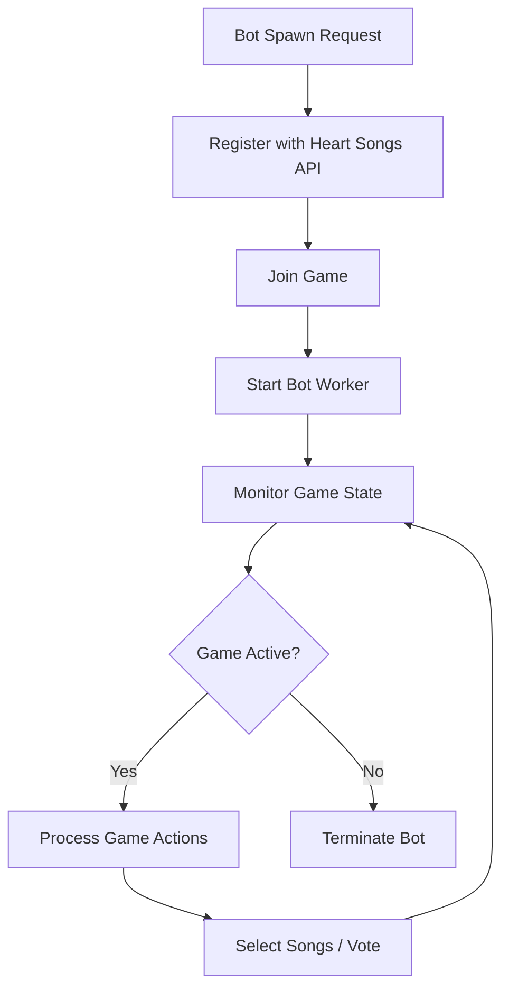

# Heart Songs Bot Service

An AWS Lambda-based bot service for the Heart Songs music game platform. This service provides AI-powered bots that can play music games with different personalities and voting strategies.

## 🤖 Features

### Bot Personalities
- **Eclectic Explorer**: Loves discovering hidden gems across all genres
- **Chart Topper**: Knows all the hits and crowd favorites  
- **Indie Insider**: Champions underground and alternative artists
- **Time Traveler**: Expert in classic tracks from decades past
- **Music Scholar**: Makes decisions based on musical theory and lyrics

### Core Capabilities
- **AI-Powered Song Selection**: Uses OpenAI GPT-4o-mini to suggest contextually appropriate songs
- **Voting Logic**: Analyzes submissions and votes based on personality
- **Question Generation**: Creates engaging questions when bots win rounds
- **Rate Limiting & Retry Logic**: Error handling with exponential backoff
- **Duplicate Handling**: Automatically finds alternatives when songs are already selected
- **Self-Voting Strategy**: 2-player game voting decisions

### Technical Features
- **Serverless Architecture**: Built on AWS Lambda with Serverless Framework
- **Automatic Cleanup**: Bots self-terminate after 24 hours or game completion
- **State Management**: Tracks game states and handles timeouts gracefully
- **Logging**: Debugging and monitoring capabilities
- **Test Suite**: Testing for rate limiting and retry logic

## 🚀 Quick Start

### Prerequisites
- Node.js 18+ (Node 18 is EOL, consider upgrading)
- AWS CLI configured
- Serverless Framework
- OpenAI API key

### Installation

1. **Clone the repository**
   ```bash
   git clone <repository-url>
   cd heartsongs-bot-service
   ```

2. **Install dependencies**
   ```bash
   npm install
   ```

3. **Configure environment variables**
   ```bash
   # Set your OpenAI API key
   export OPENAI_API_KEY="your-openai-api-key"
   
   # Set the Heart Songs API URL
   export HEARTSONGS_API_URL="https://heart-songs-development.onrender.com/api"
   ```

4. **Deploy to AWS**
   ```bash
   serverless deploy
   ```

### Environment Variables

| Variable | Description | Required |
|----------|-------------|----------|
| `OPENAI_API_KEY` | OpenAI API key for AI-powered features | Yes |
| `HEARTSONGS_API_URL` | Base URL for the Heart Songs API | Yes |
| `SERVICE_NAME` | Name of the serverless service | Auto-set |
| `STAGE` | Deployment stage (dev/prod) | Auto-set |

## 🎮 Usage

### Spawning Bots

```bash
# Spawn an eclectic bot
curl -X POST https://your-api-gateway-url/spawn-bot \
  -H "Content-Type: application/json" \
  -d '{
    "gameCode": "ABC123",
    "personality": "eclectic"
  }'
```

### Available Personalities

- `eclectic` - Eclectic Explorer (default)
- `mainstream` - Chart Topper  
- `indie` - Indie Insider
- `vintage` - Time Traveler
- `analytical` - Music Scholar

### API Endpoints

| Endpoint | Method | Description |
|----------|--------|-------------|
| `/spawn-bot` | POST | Spawn a new bot for a game |
| `/cleanup` | POST | Clean up stale bot workers |
| `/debug` | GET | Debug endpoint for testing |

## 🧪 Testing

### Run the Test Suite

```bash
# Test rate limiting and retry logic
node test/test-rate-limiting.js

# Test basic bot functionality
node test/test-bot-service.js

# Test cleanup functionality
node test/test-cleanup.js
```

### Test Coverage

- Bot spawning with different personalities
- Rate limiting behavior
- Retry logic with exponential backoff
- Error handling for invalid game codes
- API integration testing

## 🏗️ Architecture

### Lambda Functions

1. **spawn-bot**: Main entry point for creating new bots
   - Handles bot registration with Heart Songs API
   - Implements rate limiting and retry logic
   - Spawns bot-worker instances

2. **bot-worker**: Core bot logic and game interaction
   - Manages game state and transitions
   - Handles song selection and voting
   - Implements AI-powered decision making

3. **cleanup**: Maintenance and cleanup operations
   - Removes stale bot workers
   - Handles orphaned Lambda instances

4. **debug**: Development and debugging utilities

### Bot Lifecycle



## 🔧 Configuration

### Serverless Configuration

The service uses `serverless.yaml` for deployment configuration:

- **Runtime**: Node.js 18
- **Memory**: 512MB (bot-worker), 256MB (others)
- **Timeout**: 15 minutes (bot-worker), 30 seconds (others)
- **Region**: us-east-1

### Rate Limiting

- **Local Rate Limit**: 10 bot spawns per minute
- **API Retry Logic**: 5 retries with exponential backoff
- **Random Delays**: 0-2 second delays to reduce API load

## 📊 Monitoring

### CloudWatch Logs

All Lambda functions log to CloudWatch:

- Bot spawning and registration
- Game state transitions
- AI API calls and responses
- Error handling and retries
- Performance metrics

### Key Metrics

- Bot spawn success rate
- API retry frequency
- Game completion rate
- AI response times

## 🐛 Troubleshooting

### Common Issues

1. **"Too Many Requests" Errors**
   - The service now includes robust retry logic
   - Check CloudWatch logs for retry attempts
   - Verify rate limiting is working

2. **Bot Not Joining Games**
   - Check Heart Songs API connectivity
   - Verify game codes are valid
   - Review bot registration logs

3. **AI Features Not Working**
   - Verify OpenAI API key is set
   - Check API quota and billing
   - Review AI response logs

### Debug Commands

```bash
# Check function logs
serverless logs -f spawn-bot
serverless logs -f bot-worker

# Test individual functions
serverless invoke -f spawn-bot --data '{"gameCode":"TEST123"}'
```

## 🤝 Contributing

This project is licensed under the GNU Affero General Public License v3.0. See [LICENSE](LICENSE) for details.

### Development Setup

1. Fork the repository
2. Create a feature branch
3. Make your changes
4. Add tests for new functionality
5. Submit a pull request

### Code Style

- Use meaningful variable names
- Add logging
- Include error handling
- Write tests for new features

## 📝 License

This project is licensed under the GNU Affero General Public License v3.0 - see the [LICENSE](LICENSE) file for details.

## 🙏 Acknowledgments

- Built for the Heart Songs music game platform
- Powered by OpenAI GPT-4o-mini
- Deployed on AWS Lambda with Serverless Framework
